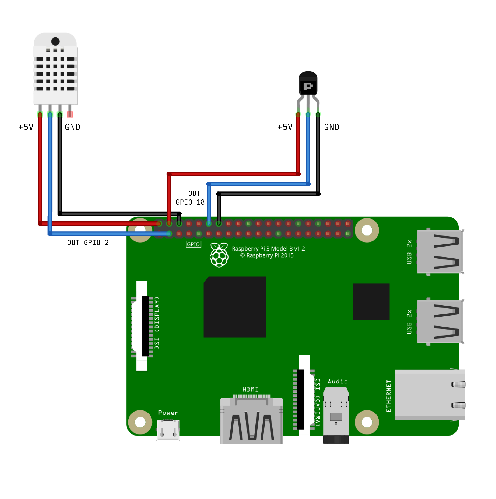

# homautomation

This repository contains everything used for my home monitoring and security, using some raspberry pi cards and sensors.

## Structure

```
.
├── app
│   ├── client
│   └── server
├── discord
├── docs
├── nix
│   ├── etc
│   └── opt
├── python
└── README.md
```

- `./app` contains the dashboard and the monitoring system
- `./discord` contains the discord bot
- `./docs` contains the documentation
- `./nix` replicates a `*nix` architectures. All the system and conf files used to deploy the services and use the project in real life
- `./python` contains all the sensors scripts


## Sensors

You can find an example of how to connect one hall effect switch and one DHT11 temperature/humidity sensor to the Rapsberry Pi 3B. They are both connected using 3 different cables:
- +5V power supply
- Ground
- Output cable to one GPIO pin (GPIO 2 for DHT11 sensor and GPIO 18 for the hall switch)



### PiCamera 2

#### Shell

Max size of images is `3280x2464`.

```bash
raspistill --width 3280 --height 2464 -o pic.jpg
```

#### Python

```python
from time import sleep
from picamera import PiCamera

camera = PiCamera()
camera.resolution = (1024, 768)
camera.start_preview()
# Camera warm-up time
sleep(2)
camera.capture('pic.jpg')
```

## App

The app package contains both client and web server used to display all the sensor data in a webapp.

## RethinkDB

RethinkDB is used to store all sensors data. We use the python client to post data and fetch it when needed. For now, RethinkDB is hosted on a laptop, but will be hosted to a Raspberry Pi 4 in the future.

NB: Think about `--bind all` option to access it from outside. Otherwise, database won't be reachable by other Pis on your local network.

## Sysadmin

### Configure ssh notifications

Source: Alberto Marchetti, [medium](https://medium.com/@cmaster11/how-to-get-notified-whenever-someone-logs-in-via-ssh-947a8f8d4f37). Send a message when someones logs to your server via ssh.

- Create file `/opt/notify-ssh.sh` using file in this repo
- edit `/etc/pam.d/sshd` and add the following line at the end

```shell
session [default=ignore] pam_exec.so /bin/bash /opt/notify-ssh.sh
```

`notify-ssh.sh` can be found in `./nix/opt/notify-ssh.sh`

### Setup SMTP

## Pi & mail server

```bash
sudo apt-get update && sudo apt-get upgrade
sudo apt-get install ssmtp
sudo nano /etc/ssmtp/ssmtp.conf
```

An example of `ssmtp.conf` can be found in `./nix/etc/ssmtp/ssmtp.conf`