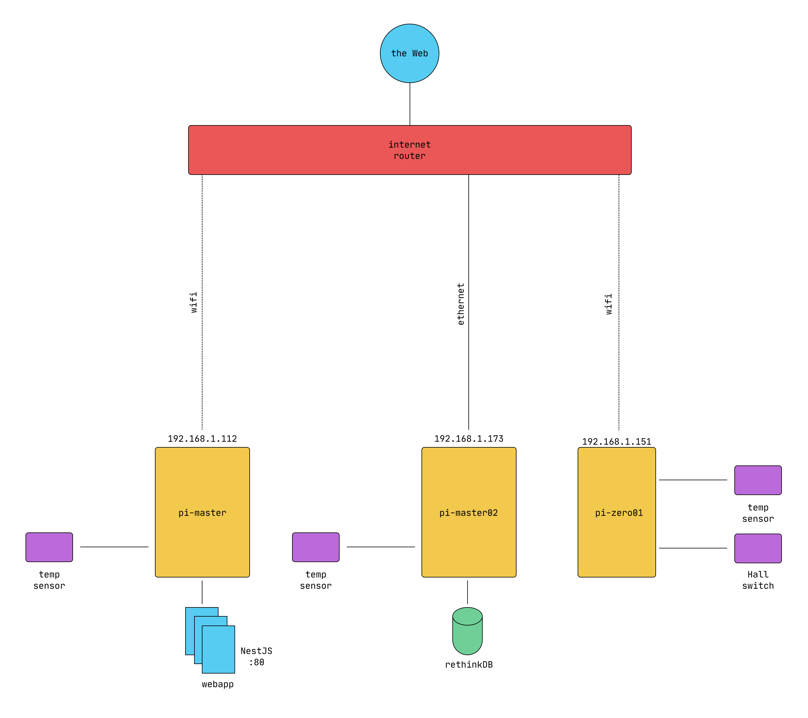
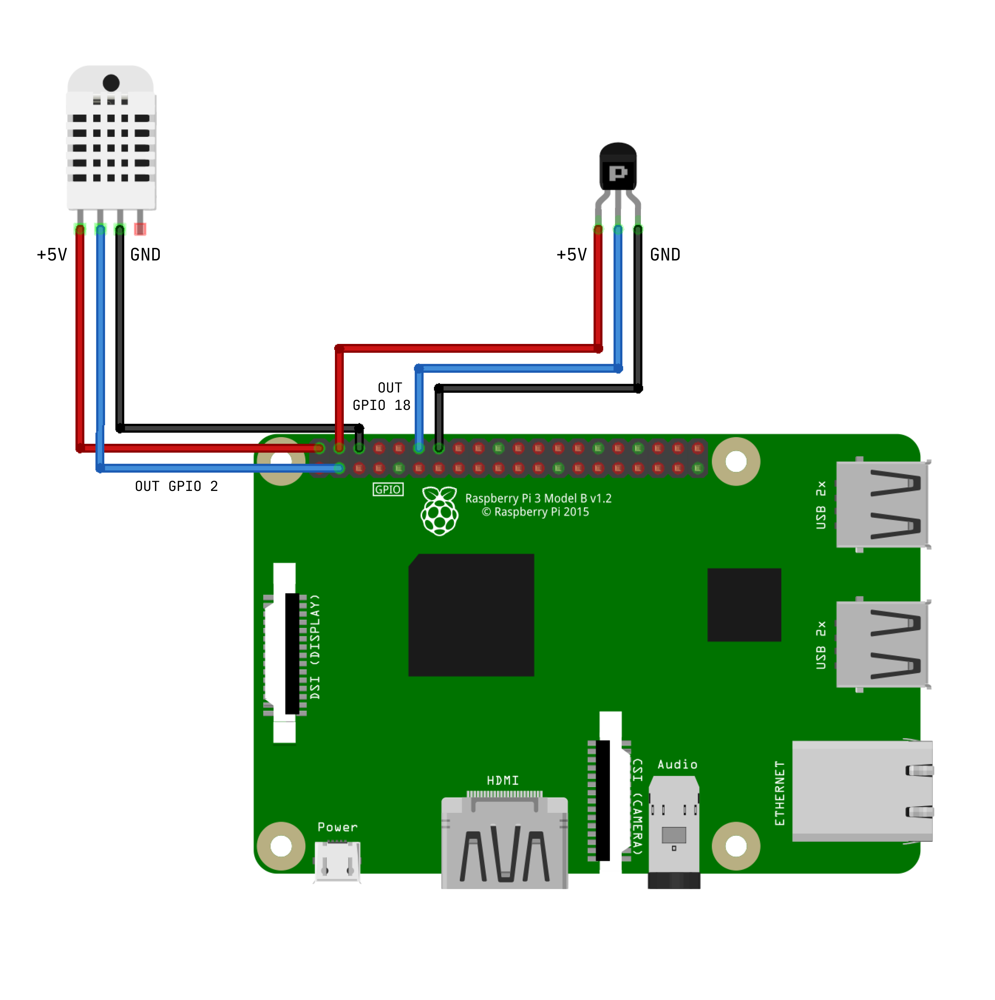

# Home Automation with Raspberry Pis

## Introduction

I have a Raspberry Pi model 3 buried under my desk for 2 years, and I don't know what to do. I was not really interested in building a  gaming pi with Retropie, nor a NAS server. The only project which was interesting to me at this time was pi-hole. But I did nothing. Thus, in the past few weeks, I have decided to dig into it and to find something to do with it: a home automation project. I wanted to track some data in my apartment, such as temperature, humidity, and front door opening (for security purposes).

## Hardware

I have used the following hardware:

- 1x Rapsberry Pi Model 3B
- 1x Rapsberry Pi Model 4B
- 1x Raspberry Pi Zero Model WH (with GPIO pins)
- 1x Hall effect switch: electronic component which returns either 0 or 1 whether a magnetic field is applied or not.
- Some neodymium magnets (for Hall effect switch). Basically, you put your Hall effect switch on the wall and the magnet on the door. When the door is opened, the magnetic field disappear and the sensor value change. When the door is closed, the field is re-applied and the value change again. Thus, you can register `open -> close` and `close -> open` transitions.
- 3x DHT11 Temperature/Humidity sensors: cheap sensors returning humidity and temperature measurements. They are not super precise, and you should probably consider buying better ones if you need more precision regarding your temperature and humidity tracking.
 
## Software conception

The main idea was:

- Measure sensor values
- Save all the values in realtime
- Access to the data in realtime throught a webapp
- Get notifications for some events (`door has been opened` for example)

I have decided to:

- Use python for all the sensor measurements. These python scripts would run as daemons on a light (and cheap) Raspberry Pi Zero WH.
- Use RethinkDB, a realtime database, for pushing on the fly the sensor values. This database would be hosted on a more robust Pi, the Raspberry Pi 4, because it's an activity more demanding.
- Use a classic webapp architecture client (Angular) / server (Python FastAPI) server for the dashboard logging the data.
- For notifications, I have tried several things. First, I have started with SMTP email notification, through a dedicated gmail account. Python scripts will SMTP-authenticate and send me some email when a specific event occur. I have also used Gmail Bot for Telegram, to be able to receive these notifications as direct messages as well. But I was not really happy of being 'spammed' that much by email. I have decided afterwards to develop and use a private Discord bot, running as a service on the Raspberry Pi 4 as well. This bot will be able to respond some commands and to give me the last expected values for each measure. For example `!temperature` would return last temperature measured by the sensor etc. We could also imagine using these commands to make measures the moment we request it, but I have configured my sensors to take measurements every hour. That precision was sufficient to me.

## System architecture

### Network



### Connect sensors to the Raspberry Pi

The sensors I have bought can both be connected to +5 input (`VCC`). `GND` must be connected to the ground. `OUT` cable must be connected to a GPIO pin. I have chosen GPIO 2 for DHT11 sensor and GPIO 18 for hall effect switch.


You can see the GPIO pin map by typing `pinout` in a shell.

```
> pinout
,--------------------------------.
| oooooooooooooooooooo J8     +====
| 1ooooooooooooooooooo        | USB
|                             +====
|      Pi Model 3B  V1.2         |
|      +----+                 +====
| |D|  |SoC |                 | USB
| |S|  |    |                 +====
| |I|  +----+                    |
|                   |C|     +======
|                   |S|     |   Net
| pwr        |HDMI| |I||A|  +======
`-| |--------|    |----|V|-------'

Revision           : a02082
SoC                : BCM2837
RAM                : 1024Mb
Storage            : MicroSD
USB ports          : 4 (excluding power)
Ethernet ports     : 1
Wi-fi              : True
Bluetooth          : True
Camera ports (CSI) : 1
Display ports (DSI): 1

J8:
   3V3  (1) (2)  5V    
 GPIO2  (3) (4)  5V    
 GPIO3  (5) (6)  GND   
 GPIO4  (7) (8)  GPIO14
   GND  (9) (10) GPIO15
GPIO17 (11) (12) GPIO18
GPIO27 (13) (14) GND   
GPIO22 (15) (16) GPIO23
   3V3 (17) (18) GPIO24
GPIO10 (19) (20) GND   
 GPIO9 (21) (22) GPIO25
GPIO11 (23) (24) GPIO8 
   GND (25) (26) GPIO7 
 GPIO0 (27) (28) GPIO1 
 GPIO5 (29) (30) GND   
 GPIO6 (31) (32) GPIO12
GPIO13 (33) (34) GND   
GPIO19 (35) (36) GPIO16
GPIO26 (37) (38) GPIO20
   GND (39) (40) GPIO21
```

## Software development

### Sensors

#### Development

#### Deployment

### RethinkDB

#### Installation

RethinkDB's installation may be a bit challenging because you have to download sources and compile it from them. You may go through some issues depending on the compiler you are using.

```bash
# Install dependencies
> sudo apt-get install g++ protobuf-compiler libprotobuf-dev libboost-dev curl m4 wget libssl-dev

# Install clang
> sudo apt-get install clang-9

# Configure clang
> sudo alias /usr/bin/clang++-9 /usr/bin/clang++

# Get rethinkdb sources
> wget https://download.rethinkdb.com/repository/raw/dist/rethinkdb-2.4.0.tgz
> tar xf rethinkdb-2.4.0.tgz

# Build
> cd rethinkdb-2.4.0
> ./configure --allow-fetch CXX=clang++
> sudo make install

# Test if installation has been successfull
> rethinkdb
```

Bonus: If you want to access RethinkDB web UI from another computer within your home network, by typing in your browser `http://<SERVER_IP>:8080`, it seems you have to start rethinkdb using `--bind all` option, i.e. `rethinkdb --bind all`.

#### Deployment

I use `Systemctl` to run RethinkDB as a daemon. Create the following file at `/etc/systemd/system/rethinkdb.service` by replacing `${USER}` by the user which needs to run RethinkDB:

```
# ---- content of /etc/systemd/system/rethinkdb.service ----
[Unit]
Description=Rethinkdb service
After=network.target

[Service]
User=${USER}
Restart=always
Type=simple
WorkingDirectory=/home/${USER}
ExecStart=/usr/local/bin/rethinkdb --bind all

[Install]
WantedBy=multi-user.target
# ----------------------------------------------------------
```

You have to restart daemon with `sudo systemctl daemon-reload` and run the service with `sudo systemctl start rethinkdb`'. You can verify it's started:

```
> sudo systemctl start rethinkdb

● rethinkdb.service - Rethinkdb service
   Loaded: loaded (/etc/systemd/system/rethinkdb.service; disabled; vendor preset: enabled)
   Active: active (running) since Thu 2020-07-23 18:59:55 CEST; 1 weeks 1 days ago
 Main PID: 7260 (rethinkdb)
    Tasks: 73 (limit: 3862)
   CGroup: /system.slice/rethinkdb.service
           ├─7260 /usr/local/bin/rethinkdb --bind all
           └─7276 /usr/local/bin/rethinkdb --bind all

juil. 23 18:59:55 pi-master02 systemd[1]: Started Rethinkdb service.
```

### Discord bot

#### Development

```python
import discord
import os
from rethinkdb import r
from dotenv import load_dotenv

load_dotenv(verbose=True)

db_host = os.getenv('DB_HOST')
db_port = os.getenv('DB_PORT')
token = os.getenv('DISCORD_TOKEN')

client = discord.Client()
conn = r.connect(db_host, db_port).repl()


def get_temperature():
    cursor = r.db('dashboard') \
              .table('temperatures') \
              .order_by(r.desc('timestamp')) \
              .run(conn)
    return cursor[0]['value'], cursor[0]['timestamp']


def is_me(m):
    return m.author == client.user


@client.event
async def on_ready():
    print('We have logged in as {0.user}'.format(client))


@client.event
async def on_message(message):
    if message.author == client.user:
        return

    if message.content.startswith('!temperature'):
        value, ts = get_temperature()
        pattern = 'Temperature: {}°C ({}-{}-{} {}:{})'
        await message.channel.send(pattern.format(
            value,
            ts.year,
            ts.month,
            ts.day,
            ts.hour,
            ts.minute
        ))

    if message.content.startswith('!clear'):
        await message.channel.purge(limit=100)


if __name__ == '__main__':
    client.run(token)
```

#### Deployment

Like our other services, we can deploy the discord bot using `systemctl`, after describing the service in a dedicated file located at `/etc/systemd/system/discord.bot`:

```bash
# -------- content of /etc/systemd/system/discord.bot --------
[Unit]
Description=Discord bot service
After=network.target

[Service]
User=${USER}
Restart=always
Type=simple
WorkingDirectory=/path/to/python/repo
ExecStart=/path/to/pipenv run python3 -u /path/to/python/repo/bot.py

[Install]
WantedBy=multi-user.target
# ------------------------------------------------------------
```

```bash
> sudo systemctl start discord.bot
...

> sudo systemctl status discord.bot

● discord.bot.service - Discord bot service
   Loaded: loaded (/etc/systemd/system/discord.bot.service; disabled; vendor preset: enabled)
   Active: active (running) since Sun 2020-07-26 23:19:11 CEST; 5 days ago
 Main PID: 28136 (python3)
    Tasks: 22 (limit: 3862)
   CGroup: /system.slice/discord.bot.service
           └─28136 /home/${USER}/.local/share/virtualenvs/discord-L7UosTov/bin/python3 -u /home/${USER}/code/homautomation

juil. 26 23:19:11 pi-master02 systemd[1]: Started Discord bot service.
juil. 26 23:19:13 pi-master02 pipenv[28136]: Loading .env environment variables…
juil. 26 23:19:17 pi-master02 pipenv[28136]: We have logged in as HomeBot#5246
```

## Conclusion
